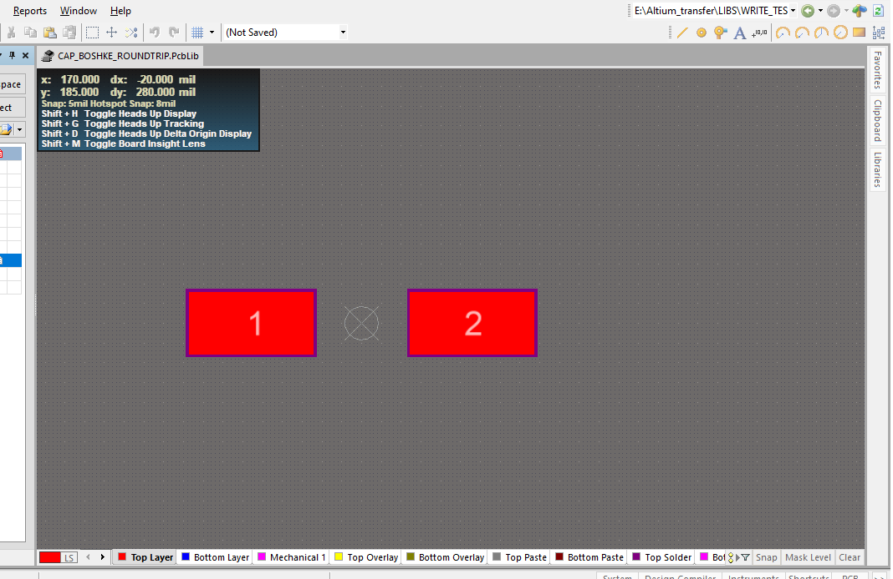
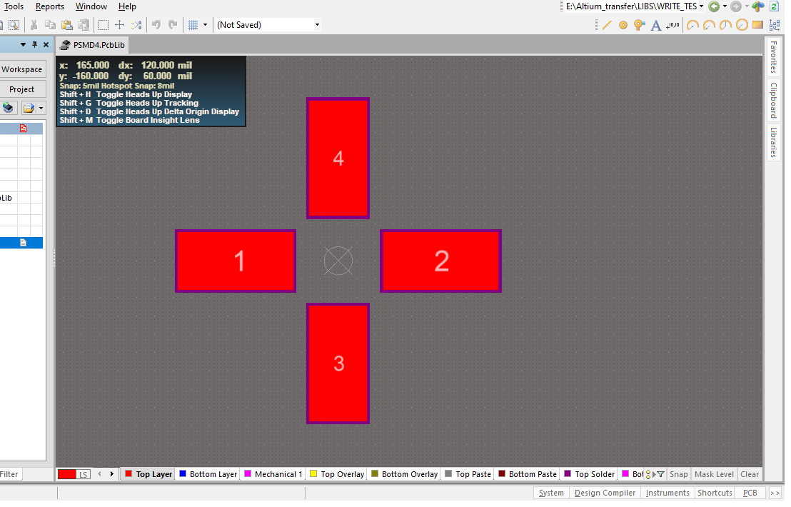

# Milestone: Programmatic Pad Duplication and Rotation

## Introduction

One of the main goals of **AltiumPcbLibTools** is to make the manipulation of Altium footprints possible at a semantic and programmatic level.

Pads are a particularly important part of this goal.

A PCB footprint may contain only a few pads, but it may also contain many pads arranged according to a precise geometric pattern. Creating such arrangements manually can become tedious and error-prone, especially when pads must be placed at specific coordinates and arbitrary rotation angles.

This example demonstrates that a pad definition can be created once and then reused by multiple pad instances, while each instance can have its own position and rotation.

The result is a practical mechanism for programmatic footprint construction and transformation.

---

## The Original Footprint

The starting footprint contains two rectangular pads on the Top Layer.

The extracted semantic representation contains one Pad Master and two pad instances:

```json
{
    "pad_masters": [
        {
            "id": "PAD_MASTER_001",
            "shape": "rectangle",
            "main": {
                "size": {
                    "width": 1574803,
                    "height": 787402
                },
                "layer": "Top Layer"
            }
        }
    ],
    "pads": [
        {
            "designator": "1",
            "master": "PAD_MASTER_001",
            "position": {
                "x": -1397638,
                "y": 0
            },
            "rotation": 0.0,
            "override": {}
        },
        {
            "designator": "2",
            "master": "PAD_MASTER_001",
            "position": {
                "x": 1397638,
                "y": 0
            },
            "rotation": 0.0,
            "override": {}
        }
    ]
}
```

The important observation is that the two pads do not contain independent copies of the complete pad definition.

Both reference:

```text
PAD_MASTER_001
```

---

## What Is a Pad Master?

A **Pad Master** represents the common definition of a pad.

It contains properties such as the pad shape, dimensions, layer, and other pad-specific properties.

For this example:

```json
{
    "id": "PAD_MASTER_001",
    "shape": "rectangle",
    "main": {
        "size": {
            "width": 1574803,
            "height": 787402
        },
        "layer": "Top Layer"
    }
}
```

The Pad Master answers the question:

> **What is this pad?**

The individual pad instance answers:

> **Where is this pad, what is its designator, and how is it oriented?**

For example:

```json
{
    "designator": "1",
    "master": "PAD_MASTER_001",
    "position": {
        "x": -1397638,
        "y": 0
    },
    "rotation": 0.0,
    "override": {}
}
```

Therefore:

```text
PAD_MASTER_001
      |
      +-- Pad 1
      +-- Pad 2
```


## The Original Footprint

The starting footprint contains two rectangular pads on the Top Layer.



The extracted semantic representation contains one Pad Master and two pad instances:


---

## How Is the Pad Master Obtained?

The Pad Master is not manually invented for this example.

It is produced during the extraction process from the real Altium PcbLib.

The extracted pads are examined by the `PadMasterBuilder`. Pads with equivalent relevant geometry and properties can share a Pad Master.

Conceptually:

```text
Real Altium PcbLib
        |
        v
   Extract Pads
        |
        v
Compare geometry and properties
        |
        +---- same definition ----> reuse Pad Master
        |
        +---- different ----------> create new Pad Master
```

In this footprint, the two original pads have the same relevant definition, so they share `PAD_MASTER_001`.

This gives us a semantic separation between the **definition of a pad** and the **instances of that pad**.

---

## Adding New Pad Instances

We can now create additional pads without creating additional pad definitions.

The following two pad instances reuse the same Pad Master:

```json
{
    "pads_added": [
        {
            "designator": "3",
            "master": "PAD_MASTER_001",
            "position": {
                "x": 0,
                "y": -1397638
            },
            "rotation": 90.0,
            "override": {}
        },
        {
            "designator": "4",
            "master": "PAD_MASTER_001",
            "position": {
                "x": 0,
                "y": 1397638
            },
            "rotation": 90.0,
            "override": {}
        }
    ]
}
```

The resulting relationship is:

```text
PAD_MASTER_001
      |
      +-- Pad 1
      +-- Pad 2
      +-- Pad 3   <- added
      +-- Pad 4   <- added
```

Pads 3 and 4 use exactly the same Pad Master as Pads 1 and 2.

Only their instance-specific properties have changed.


## Result

The resulting footprint contains four pad instances. Pads 3 and 4 reuse the
same Pad Master while having their own positions and rotations.




---

## Position and Rotation Are Independent

This is an important part of the model.

Each pad instance has its own:

* designator
* position
* rotation
* optional overrides

Therefore, using the same Pad Master does not mean that the pads must have the same orientation.

For this example:

```text
Pad 1    (-1397638, 0)       0°
Pad 2    ( 1397638, 0)       0°
Pad 3    (0, -1397638)      90°
Pad 4    (0,  1397638)      90°
```

The same mechanism can be used with arbitrary angles.

For example, a generated footprint could contain pad instances rotated by:

```text
17°
30°
45°
73°
```

without changing the underlying Pad Master.

This is where programmatic construction becomes particularly useful.

---

## A More Difficult Real-World Example

Consider a relay or another component whose pins are arranged radially around a center.

With six pads, the angular separation may be 60°.

With twelve pads, the angular separation may be 30°.

For a circular arrangement of `N` pads, the position of each pad can be calculated from an angle:

```text
angle = 360° × k / N
```

and a radius:

```text
x = center_x + radius × cos(angle)
y = center_y + radius × sin(angle)
```

The resulting pad instances can then be assigned their own rotations.

Conceptually:

```text
                 Pad
                  |
            Pad       Pad
               \     /
                \   /
             Pad  O  Pad
                /   \
               /     \
            Pad       Pad
                  |
                 Pad
```

The important point is that the programmer does not need to manually calculate and enter every coordinate.

The footprint can instead be generated from the geometric rule.

The same Pad Master can be reused for all instances:

```text
                  PAD_MASTER
                       |
        +--------------+--------------+
        |              |              |
      Pad 1          Pad 2          Pad 3
        |              |              |
      angle          angle          angle
        |              |              |
     position       position       position
     rotation       rotation       rotation
        |              |              |
        +--------------+--------------+
                       |
                    Pad N
```

This type of arrangement is difficult to construct manually with the same precision and repeatability, particularly when arbitrary rotation angles are required.

Programmatically, however, the geometry is simply data.

---

## Why This Is More Than Pad Rotation

The important achievement demonstrated here is **not simply rotating a pad**.

Altium Designer already provides tools for manually moving and rotating pads.

The important capability is that we can:

1. Extract a real pad definition from an Altium PcbLib.
2. Represent that definition as a semantic Pad Master.
3. Create multiple pad instances from that master.
4. Assign each instance an independent position.
5. Assign each instance an independent rotation.
6. Generate the resulting PcbLib programmatically.
7. Verify the result in Altium Designer.

This changes the nature of the task.

Instead of manually constructing a footprint, we can describe the footprint as structured data and generate it from that description.

---

## Why the Pad Master Matters

Without the Pad Master concept, every pad instance would have to carry its complete definition.

With Pad Masters, the relationship becomes:

```text
                 Pad Master
                     |
       +-------------+-------------+
       |             |             |
      Pad 1         Pad 2         Pad 3
       |             |             |
    position       position      position
    rotation       rotation      rotation
```

This is both more compact and more expressive.

It also allows a transformation to modify the arrangement of pads without redefining their physical characteristics.

---

## Division of Responsibility

The project deliberately does not attempt to reinvent the complete PcbLib binary format.

`altium_monkey` provides the underlying PcbLib mechanisms used to read and write the Altium file.

**AltiumPcbLibTools** operates at a higher level.

Its responsibility is to provide concepts such as:

* Footprint
* Pad Master
* Pad
* Track
* Arc
* semantic JSON
* extraction
* transformation
* validation

The underlying PcbLib library handles the file mechanics.

This separation allows the project to concentrate on making footprint manipulation understandable and programmable rather than duplicating an existing binary-file implementation.

---

## Result

The complete transformation can be summarized as:

```text
Real Altium PcbLib
        |
        v
     Extract
        |
        v
Semantic Footprint
        |
        +-- Pad Master
        |      |
        |      +-- Pad 1
        |      +-- Pad 2
        |
        v
Programmatic transformation
        |
        +-- Pad 3 added
        +-- Pad 4 added
        +-- positions changed
        +-- rotations changed
        |
        v
     Write PcbLib
        |
        v
Altium Designer
```

The central principle demonstrated by this example is:

> **Define the pad once, instantiate it as many times as required, and control each instance independently through semantic data.**

This provides a practical foundation for constructing footprints whose pad arrangements would be tedious, repetitive, or difficult to create manually.

The same principle can be extended to more complex footprint-generation algorithms, including precise radial, symmetric, and parametrically generated pad arrangements.
